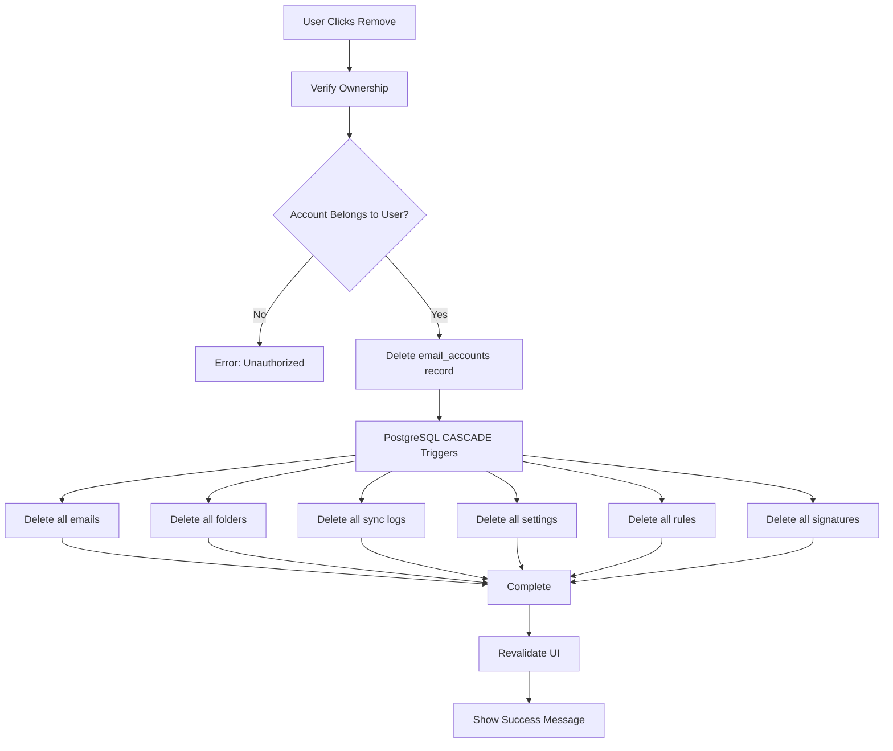
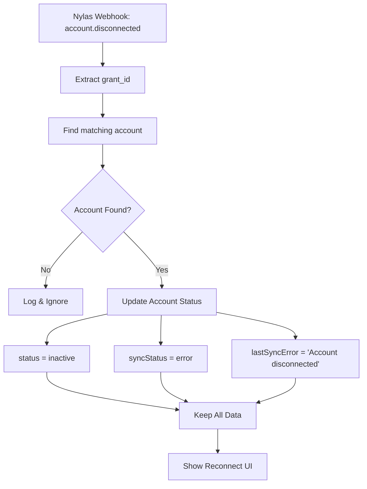

# What Happens When an Email Account is Disconnected

## 📋 Overview

When an email account is disconnected from EaseMail, there are two main scenarios:
1. **Automatic Disconnect** - Triggered by webhooks or auth failures
2. **Manual Removal** - User explicitly removes the account

## 🔄 Scenario 1: Automatic Disconnect

### Webhook-Triggered Disconnect

When Nylas detects an account issue, it sends a webhook:

```typescript
// src/app/api/webhooks/nylas/route.ts

async function handleAccountDisconnected(event: any) {
  const grantId = event.data?.grant_id;
  
  // Mark account as inactive (but DON'T delete)
  await db.update(emailAccounts).set({
    status: 'inactive',
    syncStatus: 'error',
    lastSyncError: 'Account disconnected',
    updatedAt: new Date(),
  }).where(eq(emailAccounts.nylasGrantId, grantId));
  
  console.log(`Account ${grantId} marked as disconnected`);
}
```

### Token Refresh Failure

When OAuth tokens expire and can't be refreshed:

```typescript
// Automatic disconnect after refresh failure
- Account status → 'inactive'
- syncStatus → 'error'
- lastSyncError → 'Token refresh failed - reconnect required'
- All emails REMAIN in database
- User can still read existing emails
- No new emails will sync until reconnected
```

### What DOESN'T Happen:
- ❌ Emails are NOT deleted
- ❌ Folders are NOT deleted
- ❌ Settings are NOT removed
- ❌ Account record is NOT removed
- ✅ Account is just marked inactive

### User Experience:
- 🔴 Account shows red "Disconnected" or "Error" badge
- 📧 Existing emails still visible and searchable
- ⚠️ "Reconnect Required" notification appears
- 🔄 Can click "Reconnect" to reauthorize

---

## 🗑️ Scenario 2: Manual Removal

### User-Initiated Removal

When user explicitly removes account via Settings:

```typescript
// src/lib/settings/email-actions.ts

export async function removeEmailAccount(accountId: string) {
  // 1. Verify account belongs to user
  const account = await db.query.emailAccounts.findFirst({
    where: and(
      eq(accounts.id, accountId),
      eq(accounts.userId, user.id)
    )
  });
  
  // 2. Delete the account
  // This triggers CASCADE delete of all related data
  await db.delete(emailAccounts)
    .where(and(
      eq(emailAccounts.id, accountId),
      eq(emailAccounts.userId, user.id)
    ));
  
  // 3. CASCADE automatically deletes:
  //    - All emails (emails.accountId → CASCADE)
  //    - All folders (emailFolders.accountId → CASCADE)
  //    - All sync logs (syncLogs.accountId → CASCADE)
  //    - All email settings (emailSettings.accountId → CASCADE)
  //    - All email rules (emailRules.accountId → CASCADE)
  //    - All email signatures (emailSignatures.accountId → CASCADE)
  
  return { success: true, message: 'Account removed successfully' };
}
```

### Database CASCADE Rules

The database schema enforces automatic cleanup:

```typescript
// src/db/schema.ts

// Emails table - CASCADE on account delete
export const emails = pgTable('emails', {
  accountId: uuid('account_id')
    .notNull()
    .references(() => emailAccounts.id, { onDelete: 'cascade' }),
  // ... other fields
});

// Email folders - CASCADE on account delete
export const emailFolders = pgTable('email_folders', {
  accountId: uuid('account_id')
    .notNull()
    .references(() => emailAccounts.id, { onDelete: 'cascade' }),
  // ... other fields
});

// Sync logs - CASCADE on account delete
export const syncLogs = pgTable('sync_logs', {
  accountId: uuid('account_id')
    .references(() => emailAccounts.id, { onDelete: 'cascade' }),
  // ... other fields
});

// And many more...
```

### What DOES Happen:

When account is deleted, CASCADE automatically removes:

#### 1. **Emails** (`emails` table)
- ✅ All email records deleted
- ✅ Includes inbox, sent, drafts, trash
- ✅ Removes from all folders and categories

#### 2. **Email Folders** (`email_folders` table)
- ✅ All folder definitions deleted
- ✅ Inbox, Sent, Drafts, custom folders
- ✅ Folder sync cursors removed

#### 3. **Email Attachments** (`email_attachments` table)
- ✅ All attachment records deleted
- ⚠️ Physical files in Supabase Storage may remain (cleanup recommended)

#### 4. **Email Settings** (`email_settings` table)
- ✅ Per-account settings removed
- ✅ Signature preferences deleted

#### 5. **Email Signatures** (`email_signatures` table)
- ✅ All signatures for this account deleted

#### 6. **Email Rules** (`email_rules` table)
- ✅ All automation rules deleted

#### 7. **Sync Logs** (`sync_logs` table)
- ✅ All sync history deleted

#### 8. **Scheduled Emails** (`scheduled_emails` table)
- ✅ Pending scheduled sends for this account deleted

#### 9. **Email Threads** (via `emails` CASCADE)
- ✅ Thread associations removed
- ✅ Other accounts' threads unaffected

### What DOESN'T Happen:

#### 1. **Contacts** (`contacts` table)
- ❌ NOT deleted (contacts are user-level, not account-level)
- ✅ Contacts remain accessible
- ✅ Can still use contacts with other accounts

#### 2. **Contact Groups** (`contact_groups` table)
- ❌ NOT deleted
- ✅ Groups remain intact

#### 3. **Communication History** (`communication_history` table)
- ❌ NOT deleted
- ✅ SMS and call history preserved

#### 4. **User Settings** (`users` table)
- ❌ NOT affected
- ✅ User profile intact
- ✅ Subscription status unchanged

#### 5. **Other Email Accounts**
- ❌ NOT affected
- ✅ Other connected accounts work normally

---

## 🔧 Technical Flow

### Manual Removal Process



### Webhook Disconnect Process



---

## 👤 User Experience

### Automatic Disconnect (Status: Inactive)

**What User Sees:**
```
┌──────────────────────────────────────────┐
│ ⚠️ Microsoft Account Disconnected        │
│                                          │
│ Your account needs to be reconnected.    │
│                                          │
│ ❌ Status: Disconnected                  │
│ 📧 Existing emails: Still accessible     │
│ 🔄 New emails: Not syncing               │
│                                          │
│ [Reconnect Account]  [Learn More]        │
└──────────────────────────────────────────┘
```

**Actions Available:**
- ✅ Read existing emails
- ✅ Search existing emails
- ✅ Access attachments (already downloaded)
- ✅ Reconnect account
- ❌ Receive new emails
- ❌ Send emails
- ❌ Sync changes

### Manual Removal (Account Deleted)

**Confirmation Dialog:**
```
┌──────────────────────────────────────────┐
│ ⚠️ Remove Email Account?                 │
│                                          │
│ This will permanently delete:            │
│                                          │
│ • All emails (5,234 emails)              │
│ • All folders and labels                 │
│ • All rules and settings                 │
│ • Sync history                           │
│                                          │
│ Contacts will be preserved.              │
│                                          │
│ This action CANNOT be undone.            │
│                                          │
│ [Cancel]           [Yes, Remove Account] │
└──────────────────────────────────────────┘
```

**After Removal:**
```
✅ Account removed successfully

Your emails and settings have been deleted.
Contacts and other accounts are unaffected.

You can reconnect this account anytime.
```

---

## 🔒 Security Considerations

### OAuth Token Revocation

When account is removed:
- ✅ Should revoke OAuth tokens with provider (TODO)
- ✅ Prevents unauthorized access
- ✅ Cleans up provider side

### Data Cleanup

When account is removed:
- ✅ All database records deleted via CASCADE
- ⚠️ Attachment files in storage may remain
- ⚠️ Email content in Supabase Storage may remain

**Recommendation:** Add cleanup job for orphaned files:
```typescript
// Future enhancement
async function cleanupOrphanedFiles(accountId: string) {
  // 1. List all attachments for account
  const attachments = await getAttachmentsForAccount(accountId);
  
  // 2. Delete from Supabase Storage
  for (const attachment of attachments) {
    await supabase.storage
      .from('attachments')
      .remove([attachment.storageKey]);
  }
  
  // 3. Delete email content files
  await supabase.storage
    .from('email-content')
    .remove([`account_${accountId}/*`]);
}
```

---

## 📊 Database Impact

### What Gets Deleted (with CASCADE)

| Table | Records | Impact |
|-------|---------|--------|
| `emails` | All for account | Immediate |
| `email_folders` | All for account | Immediate |
| `email_attachments` | All for account | Immediate |
| `email_settings` | All for account | Immediate |
| `email_signatures` | All for account | Immediate |
| `email_rules` | All for account | Immediate |
| `sync_logs` | All for account | Immediate |
| `scheduled_emails` | All for account | Immediate |

### What Stays (No CASCADE)

| Table | Reason |
|-------|--------|
| `contacts` | User-level data |
| `contact_groups` | User-level data |
| `communication_history` | Historical record |
| `users` | Account owner |
| Other `email_accounts` | Separate accounts |

---

## 🔄 Reconnection Process

### After Automatic Disconnect

```typescript
// User clicks "Reconnect"
1. Redirect to OAuth flow
2. Get new tokens
3. Update existing account:
   - New accessToken
   - New refreshToken  
   - status → 'active'
   - syncStatus → 'idle'
   - lastSyncError → null
4. Resume syncing
5. Keep all existing emails
```

### After Manual Removal

```typescript
// User adds account again
1. Redirect to OAuth flow
2. Get new tokens
3. Create NEW account record
4. Start fresh sync
5. No previous emails (deleted)
```

---

## 🚨 Edge Cases

### 1. Account Removed During Active Sync

**What Happens:**
- Sync loop checks if account exists
- If not found, sync stops gracefully
- No errors thrown
- In-progress operations complete

### 2. Scheduled Emails Pending

**What Happens:**
- CASCADE deletes scheduled emails
- Inngest cron job skips missing records
- No emails sent after removal

### 3. Attachments in Downloads

**What Happens:**
- Database records deleted
- Files in Supabase Storage remain (orphaned)
- Recommendation: Cleanup job needed

### 4. User Has Multiple Accounts

**What Happens:**
- Only specified account removed
- Other accounts unaffected
- Emails from other accounts intact
- Contacts shared across accounts

---

## ✅ Best Practices

### For Users

1. **Before Removing:**
   - Export important emails (future feature)
   - Download critical attachments
   - Note any custom rules/filters

2. **After Removing:**
   - Verify data is deleted
   - Check other accounts still work
   - Reconnect if needed

### For Developers

1. **Cleanup Orphaned Files:**
   ```typescript
   // Add to removal process
   await cleanupAttachmentFiles(accountId);
   await cleanupEmailContentFiles(accountId);
   ```

2. **Revoke OAuth Tokens:**
   ```typescript
   // Add to removal process
   await revokeOAuthTokens(account.provider, account.accessToken);
   ```

3. **Audit Trail:**
   ```typescript
   // Log removal action
   await logAdminAction({
     action: 'remove_email_account',
     targetId: accountId,
     details: { emailAddress: account.emailAddress }
   });
   ```

---

## 📝 Summary

### Automatic Disconnect (Inactive Status)
- ✅ Account marked inactive
- ✅ All data preserved
- ✅ Can reconnect easily
- ✅ Emails still readable
- ❌ No new emails sync

### Manual Removal (Deleted)
- ✅ Account deleted permanently
- ✅ All emails deleted (CASCADE)
- ✅ All folders deleted (CASCADE)
- ✅ All settings deleted (CASCADE)
- ✅ Contacts preserved
- ❌ Cannot undo
- ✅ Can reconnect as new account

---

**Key Takeaway:** Disconnection preserves data, removal deletes it. Users should reconnect for temporary issues and only remove for permanent deletion.

